 
<!-- -->
 

<!-- 𝐆𝐢𝐟 -->
  

 

·•·

 

 
<!--  -->

· 🎓 𝖢𝗈𝗆𝗉𝗎𝗍𝖾𝗋 𝖲𝖼𝗂𝖾𝗇𝖼𝖾 & 𝖤𝗇𝗀𝗂𝗇𝖾𝖾𝗋𝗂𝗇𝗀 𝖲𝗍𝗎𝖽𝖾𝗇𝗍
 
· 👨‍💻 𝖢𝗎𝗋𝗋𝖾𝗇𝗍𝗅𝗒 𝖥𝗈𝖼𝗎𝗌𝗂𝗇𝗀 𝗈𝗇 𝖯𝗒𝗍𝗁𝗈𝗇, 𝖧𝖳𝖬𝖫 & 𝖢𝖲𝖲

—·—

<!-- 𝐒𝐨𝐜𝐢𝐚𝐥𝐬 -->  
##  &nbsp; · &nbsp; S​​ocials &nbsp; · &nbsp; 

 .  .  .  .  .  

 .  .  

<!-- Line --> 

<!-- 𝐓𝐞𝐜𝐡 𝐒𝐭𝐚𝐜𝐤 --> 
##  &nbsp; · &nbsp; Tech Stack &nbsp; · &nbsp; 

<!-- 𝐏𝐫𝐨𝐠𝐫𝐚𝐦𝐦𝐢𝐧𝐠 𝐋𝐚𝐧𝐠𝐮𝐚𝐠𝐞𝐬 -->
 &nbsp; 
 &nbsp; 
 &nbsp; 
 &nbsp;
<!-- 𝐃𝐚𝐭𝐚𝐛𝐚𝐬𝐞 --> 
 &nbsp; 
 &nbsp;
 &nbsp; 
<!-- 𝐖𝐞𝐛 & 𝐇𝐨𝐬𝐭𝐢𝐧𝐠 --> 
 &nbsp;
 &nbsp;  &nbsp; 
 &nbsp;
 &nbsp;
 &nbsp; 
 &nbsp;
 &nbsp; 

<!-- 𝐕𝐞𝐫𝐬𝐢𝐨𝐧 𝐂𝐨𝐧𝐭𝐫𝐨𝐥 --> 
 &nbsp; 
 &nbsp; 
 
<!-- 𝐈𝐃𝐄𝐬 & 𝐄𝐝𝐢𝐭𝐨𝐫𝐬 --> 
 &nbsp; 
 &nbsp; 
 &nbsp; 
 &nbsp; 
 &nbsp; 
 &nbsp; 
 &nbsp; 
 &nbsp; 
 &nbsp; 
 &nbsp;
 &nbsp; 
 &nbsp; 
 &nbsp; 
 &nbsp; 
 &nbsp; 
 &nbsp; 
<!-- 𝐓𝐨𝐨𝐥𝐬 & 𝐃𝐨𝐜𝐬 --> 
 &nbsp; 
 &nbsp; 
 &nbsp; 
 &nbsp;
 &nbsp; 
 &nbsp; 
 &nbsp;
 &nbsp; 
<!-- 𝐃𝐞𝐬𝐢𝐠𝐧 & 𝐎𝐭𝐡𝐞𝐫 --> 
 

<!-- Line --> 

–·–
 
 ##   &nbsp; Featured Projects &nbsp;   &nbsp; 

> ### 🍛 [AhaarBonton](https://github.com/TajkirHossen-14/Ahaar_Bonton)  
> A surplus food redistribution platform connecting donors, NGOs and volunteers to reduce food waste.

> ### 🏠 [Smart Eco Home Manager](https://github.com/TajkirHossen-14/Smart_Eco_Home_Manager)  
> A smart home management system focused on energy efficiency and eco-friendly living.

> ### 🎮 [Esports Tournament Management](https://github.com/TajkirHossen-14/Esports_Tournament_Management)  
> A tournament management system for esports events with team and match tracking.

 –·–·– 
 

<!-- Line --> 

<!--
## 🚀 Featured Projects

<table>
<tr>
<td width="50%" valign="top">

### 🏠 [Smart Eco Home Manager](https://github.com/TajkirHossen-14/Smart_Eco_Home_Manager)
A smart home management system focused on **energy efficiency** and eco-friendly living. Monitors and controls home appliances to reduce energy consumption and promote sustainable living.

`Python` `HTML` `CSS`

</td>
<td width="50%" valign="top">

### 🎮 [Esports Tournament Management](https://github.com/TajkirHossen-14/Esports_Tournament_Management)
A comprehensive tournament management system for **esports events**. Handles team registration, match scheduling, bracket generation, and real-time score tracking.

`Python` `HTML` `CSS`

</td>
</tr>
</table>
-->

<!-- 𝐆𝐢𝐭𝐇𝐮𝐛 𝐒𝐭𝐚𝐭𝐬 -->
##  &nbsp; · &nbsp; GitHub Stats &nbsp; · &nbsp;  &nbsp;  

<!-- 𝐒𝐭𝐫𝐞𝐚𝐤+𝐎𝐭𝐡𝐞𝐫 𝐒𝐭𝐚𝐭𝐬 -->

  <picture>
    <source media="(prefers-color-scheme: dark)" srcset="https://yourinsights.vercel.app/api/insight?username=TajkirHossen-14&theme=github_dark&graph=false&languages=true&streak=true&stats=true&header=false&summary=false&profile=false"/>
    
  </picture>

<!-- 𝐆𝐢𝐭𝐅𝐮𝐭 -->

 
 
 ### · &nbsp; GitFut Card &nbsp; ·

<!-- 
 –·– 
 -->

<!-- 𝐆𝐢𝐭𝐇𝐮𝐛 𝐓𝐫𝐨𝐩𝐡𝐢𝐞𝐬 -->

 
 
 ### · &nbsp; GitHub Trophies &nbsp; ·

  <picture>
    <source media="(prefers-color-scheme: dark)" srcset="./Assets/trophy-dark.svg"/>
    
  </picture>

 
<!--br-->
 
<!-- 𝐓𝐨𝐩 𝐋𝐚𝐧𝐠𝐮𝐚𝐠𝐞𝐬 -->
<!-- 
<picture>            
    <source media="(prefers-color-scheme: dark)" srcset="https://github-readme-stats-62m5yuvkq-tajkirhossen14-4627s-projects.vercel.app/api/top-langs?username=TajkirHossen-14&title_color=fafbff&text_color=f0f6ff&bg_color=0D1117&border_color=c9d1d9&layout=compact&langs_count=10&hide_border=false&card_width=396&count_private=true"/>
    
</picture>

-->

<!-- Line --> 

<!-- 𝐆𝐢𝐭𝐇𝐮𝐛 𝐀𝐜𝐭𝐢𝐯𝐢𝐭𝐲 -->
##  &nbsp; · &nbsp; GitHub Activity &nbsp; · &nbsp;  

<picture>
  <source media="(prefers-color-scheme: dark)" srcset="https://github-profile-summary-cards.vercel.app/api/cards/profile-details?username=TajkirHossen-14&theme=github_dark"/>
  <source media="(prefers-color-scheme: light)" srcset="https://github-profile-summary-cards.vercel.app/api/cards/profile-details?username=TajkirHossen-14&theme=github"/>
  
</picture>

<!-- 𝟑𝐃 𝐏𝐫𝐨𝐟𝐢𝐥𝐞 𝐂𝐨𝐧𝐭𝐫𝐢𝐛𝐮𝐭𝐢𝐨𝐧 -->
<picture>
  <source media="(prefers-color-scheme: dark)" srcset="https://raw.githubusercontent.com/TajkirHossen-14/TajkirHossen-14/main/profile-3d-contrib/profile-night-green.svg"/>
  
</picture>

<!-- Line --> 

<!-- 𝐌𝐨𝐧𝐤𝐞𝐲𝐓𝐲𝐩𝐞 𝐂𝐚𝐫𝐝 -->

## · MonkeyType Stats ·

  <a href="https://monkeytype.com/profile/Tajkir_Hossen">
    <picture>
      <source media="(prefers-color-scheme: dark)" srcset="https://raw.githubusercontent.com/TajkirHossen-14/TajkirHossen-14/monkeytype-readme-dark/monkeytype-readme-pb.svg"/>
      
    </picture>
  </a>

<!-- Line --> 

